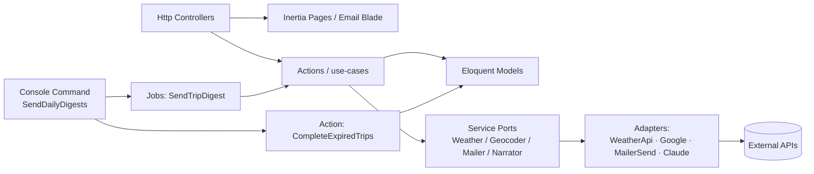
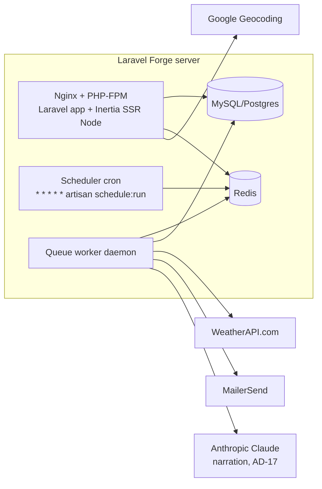

# Architecture Spine — Tripcast v1

## Design Paradigm

**Laravel layered + provider ports + a pipes-and-filters send pipeline.** Idiomatic Laravel everywhere, with two things made first-class because the product hinges on them: the **swappable external boundary** (weather, geocoding, mail behind interfaces) and the **daily send** (an explicit staged pipeline of Jobs).

| Layer | Lives in | Holds |
| --- | --- | --- |
| Presentation | `resources/js/Pages/` (Inertia/Vue, SSR), `resources/views/emails/` (Blade mailables) | Landing, dashboard, admin, auth screens; digest + welcome email templates |
| HTTP (thin) | `app/Http/Controllers/` | Request validation, auth, delegate to an Action, return an Inertia response |
| Use-cases | `app/Actions/` | One class per use-case (`CreateTrip`, `SendTripDigest`, `EndTrip`, `CompleteExpiredTrips`, `RequestMagicLink`) — the domain logic |
| Domain data | `app/Models/` | Eloquent models + the single state-transition surface on `Trip` |
| Ports + adapters | `app/Services/Weather/`, `app/Services/Geocoding/`, mail | An interface (port) + a concrete adapter, bound in a `ServiceProvider` |
| Send pipeline | `app/Digest/`, `app/Console/Commands/`, `app/Jobs/` | The scheduler command (select + dispatch) and the per-trip send Job |

## Invariants & Rules

Dependency direction — an arrow means "may depend on"; nothing points back the other way:



### AD-1 — External I/O only through ports `[ADOPTED]`
- **Binds:** weather, geocoding, email — all of `app/Services`, every call site (FR-10, FR-11, email FRs)
- **Prevents:** provider SDK calls leaking into controllers/actions, so a swap touches one adapter not every call site
- **Rule:** every external provider is reached through a PHP interface (`WeatherProvider`, `Geocoder`, mail via Laravel's Mailer) bound to a concrete adapter in a `ServiceProvider`. Code depends on the interface; the adapter is the only place the vendor SDK/HTTP appears. Weather is requested **by coordinates only** — no geocoding dependency on the weather provider.

### AD-2 — Per-trip send is a dispatchable Job; the command only selects + dispatches
- **Binds:** the daily send (FR-6), `app/Console/Commands`, `app/Jobs`, `app/Digest`
- **Prevents:** a monolithic inline loop that can't be parallelized — this is the named scaling seam, built open
- **Rule:** the scheduled `SendDailyDigests` command does exactly two things — compute the due-trip set and dispatch one `SendTripDigest` job per trip. All per-trip work (claim, fetch forecast, render, send, log, retry) lives inside the job. v1 dispatches to Redis; running sync vs worker is config, never structure.

### AD-3 — Idempotency via a claim-first unique constraint
- **Binds:** the send Job, any retry/backfill (FR-6 "no duplicate digest per trip per date")
- **Prevents:** double-sends across retries, crash-reruns, and future concurrent queue workers
- **Rule:** `email_logs` has a **DB unique index on `(trip_id, send_date)`**. The job inserts the log row (`status = sending`, with a `claimed_at` lease timestamp) **before** fetching/sending; a duplicate insert fails the unique constraint and the job aborts as already-claimed. The forecast is **fetched once** and its snapshot persisted on the claimed row *before* delivery, so a delivery retry never re-fetches weather (AD-4). A row stuck in `sending` past a stale-lease threshold (crash mid-send) is **reclaimable** by a later run; absent reclamation that trip simply misses *that* day's digest and resumes next day — an accepted, logged loss, not a silent corruption. The row is the dedup authority — not an in-memory check.

### AD-4 — Bounded in-process delivery retry, then defer; never send a broken digest `[ADOPTED]`
- **Binds:** the send Job (Cross-Cutting NFR "Reliability of the daily send")
- **Prevents:** broken/empty forecasts going out, infinite retry storms, and the queue re-dispatching into its own claim
- **Rule:** the Laravel job runs with **`tries = 1`** — Laravel's queue must never re-dispatch it (a re-dispatch would hit its own claim row and abort). Retry is **in-process, ≤ 3×, on delivery only** (the forecast snapshot is already persisted per AD-3; weather is not re-fetched). The job **always reaches a terminal state**: success → `email_logs.status = sent`; exhausted/failed → `status = failed` with a reason. No row is left in `sending` by normal flow. Recovery from a `failed` (or reclaimed-stale) row is the **next day's run** (a new `send_date`, a new row). A digest is never sent with fabricated or stale forecast values in place of a real one.

### AD-5 — One owner for Trip status; completion is a status-agnostic sweep
- **Binds:** every surface that changes `Trip.status` — dashboard (FR-12), email end-trip link (FR-5), daily job, admin
- **Prevents:** three features mutating `status` incompatibly; paused-past-return trips lingering forever
- **Rule:** `status` defaults to `active`; transitions go through a **single state-transition method on `Trip`** (`active ⇄ paused` by user; `→ completed` by system or end-trip link). `completed` is **terminal** — no transition leaves it. No controller/job writes `status` directly. Completion is a **dedicated daily `CompleteExpiredTrips` sweep** that transitions **any** trip past its Return Date to `completed` regardless of active/paused — separate from the send pipeline, which only sends. **Delete (FR-12) is a soft delete** (`deleted_at`): the trip leaves cadence and the UI but its `email_logs`/`feedback` survive (AD-9 keeps the metric/audit trail) — no hard delete cascades the source of truth away.

### AD-6 — Single-use login tokens; email actions are signed but state-change is confirm-then-POST `[ADOPTED]`
- **Binds:** authentication (FR-3, FR-4) and login-free email actions (FR-5, FR-8); promo-click attribution (FR-18)
- **Prevents:** replayable login links; and mail-scanner/prefetch GETs silently mutating state
- **Rule:** magic-link **login** uses a dedicated single-use `login_tokens` table (hashed token, expiry, `consumed_at`); requesting a **new** link invalidates prior unconsumed tokens for that user — **except a same-browser _resend_ within the link's lifetime, which re-emails the still-valid link unchanged (same token, original expiry — never extended) rather than rotating, so a delayed first email is not silently invalidated; the resend advertises the remaining minutes. To enable that reuse the raw token is retained only in the server-side session; the `login_tokens` table stays hash-only. A resend with no reusable link (consumed/expired/none stashed) issues a fresh one (rotating as usual).** **The emailed login link is itself confirm-then-POST**, exactly like the email action links below: the **GET only renders a "Sign in" confirmation page** and never consumes the token; a **CSRF-protected POST** from that page performs the single-use consume (an atomic conditional `UPDATE … WHERE consumed_at IS NULL AND not expired`) and establishes the session — so mail-scanner/prefetch GETs cannot burn the single-use token and login-CSRF is prevented. (This aligns login with `EXPERIENCE.md`'s Inbox Invariant that magic-link "resolve[s] through a confirmation landing / POST-on-confirm"; the cost is one extra tap versus a zero-click land-in-dashboard, accepted for scanner-safety.) **Email action links** are Laravel **signed URLs** scoped to the trip id, but a signed link **GET only renders a confirmation page**; the actual state change (end-trip, unsubscribe, feedback) happens on a **POST** from that page — because mail clients (Gmail/Outlook/Apple) prefetch and link-scan GETs and would otherwise auto-fire actions. Feedback writes are upserts under unique keys (AD-9 / conventions) so a re-click is idempotent. **Promo-click attribution (FR-18) is the one signed action that stays a GET**: a signed redirect route **reads-then-logs-then-forwards** to the external Amazon URL — it mutates no app state (only appends an idempotent `promo_events` row keyed `(trip_id, send_date, promo_slug, event)`), so prefetch is harmless. Sessions are long-lived cookie sessions refreshed on activity until explicit logout. No passwords exist anywhere. **The first successful consume also confirms the user's email** — it sets `users.email_verified_at` (the email-confirmation step). Until confirmed, a new signup's account + trip are **pending and do not send** (gated by AD-11); confirmation activates them and triggers their welcome (FR-9). A logged-in user (dashboard add-trip) is already confirmed, so their trips are immediately live.
  > Supersedes the PRD glossary's loose phrasing of "Magic Link = a signed URL"; AD-6 governs (login = stored single-use token, not a bare signed URL).
  > Wording reconciliation (2026-06-29, Story 1.1 code review): the earlier "clicking consumes it" phrasing for login is superseded — login consumes on a **POST-on-confirm**, not on the bare GET, matching the scanner-safety rule applied to every other email link and `EXPERIENCE.md`'s Inbox Invariants.
  > Resend reuse (2026-07-01, `sprint-change-proposal-2026-07-01.md`): the "invalidate prior unconsumed" rule governs genuinely *new* link requests; a same-browser resend of a still-valid link **reuses** it (no rotation, no expiry extension). The raw token is retained only in the server-side session (`SESSION_DRIVER=database`) for the resend window; `login_tokens` stays hash-only. Cross-device re-request has nothing stashed and rotates. See story 1-1 AC4/AC6.

### AD-7 — Two pinned time reference frames
- **Binds:** cadence selection (FR-6), countdown copy (FR-7), the completion sweep, the digest renderer
- **Prevents:** the cadence-calculator and the forecast-renderer choosing different timezones → off-by-one / wrong-day forecasts
- **Rule:** **all scheduling math** (`send_date`, Forecast-Window-open test, "N days until" countdown, completion) uses the **America/New_York calendar date** as "today" (DST-tracking — it is the send clock) — including the countdown, so it never silently switches to a destination or user frame. `trip.departure_date` / `return_date` are stored as **timezone-naive `DATE`** (no time component). The **7-day forecast rows render in the destination's local calendar days**, exactly as WeatherAPI returns them. `users.timezone` is **collected but unused for sends in v1** (AD-7's clock is fixed Eastern); any code reading it for scheduling is a violation until the per-user-send-time feature lands.

### AD-8 — Geocode once at creation; a Trip cannot exist without coordinates `[ADOPTED]`
- **Binds:** trip creation from landing (FR-1/FR-2) and dashboard add (FR-12); send-time fetch (FR-11)
- **Prevents:** unmonitorable trips with no coordinates; geocoding cost/latency at send time
- **Rule:** `latitude`, `longitude`, `canonical_place_name` are **required and set exactly once** at creation by the `Geocoder` port. Geocoding runs at the **trip-detail step — before email capture and outside any DB transaction** (it is an external HTTP call); its result is shown back for passive confirm and held in the session (AD-10). If geocoding fails, no Trip/coords are created and the user sees an inline error. The later `User`+`Trip` insert transaction (AD-10) is **DB-only**. Coordinates are never recomputed at send; the morning forecast is fetched fresh **by those stored coordinates**.

### AD-9 — EmailLog is the single per-send source of truth — and the forecast-history time-series
- **Binds:** the send Job, admin monitoring (FR-13), observability NFR, forecast history (FR-15), narration source (FR-16)
- **Prevents:** divergent forecast caches and stale data being shown
- **Rule:** each `email_logs` row carries the send outcome (`sent`/`failed` + reason) **and the weather snapshot/reference** for that send. Forecasts are cached **nowhere else** — fresh fetch every morning. Each `(trip_id, send_date)` holds **one snapshot until purged per AD-16, then absent** (the send-outcome row survives — see AD-16), so the row series **is** the day-by-day **forecast-history time-series** across the Forecast Window + trip (FR-15); no second forecast store is introduced, so "cached nowhere else" holds. **AD-9 is the sole schema/lifecycle owner of `email_logs`** — AD-3/AD-4 write status+claim, AD-16 is the only purge, AD-17 is a read-only consumer; no other mutation is sanctioned, and history/admin readers must tolerate a purged (snapshot-absent) row. The admin view reads system health from this table; FR-16 narration reads the prior `send_date`'s snapshot for the same trip from here.

### AD-10 — No orphan trips; account + trip created atomically
- **Binds:** the landing → email-capture flow (FR-1, FR-2)
- **Prevents:** half-created trip rows that need garbage collection; a nullable owner
- **Rule:** pre-account trip details **plus the already-resolved geocode result** (AD-8) are held in the **server session** through the email-capture step; on email submit, a **single DB-only transaction** upserts the `User` and inserts the `Trip` (no external calls inside the transaction). `trip.user_id` is **not nullable** — a Trip never exists without an owner.

### AD-11 — Cadence lives in one predicate `[ADOPTED]`
- **Binds:** the daily selector (FR-6), dashboard "days until" (FR-12), welcome vs digest (FR-9)
- **Prevents:** the selector and the dashboard computing "is a digest due / when" by different rules
- **Rule:** a single cadence predicate is the authority for "is this trip due a Daily Digest on date D". A trip is **due ⟺ `status == active` AND `deleted_at` is null AND the owner has confirmed their email (`email_verified_at` not null, AD-6) AND the owner is not opted out (AD-13) AND D is within `[DepartureDate − 7 days, ReturnDate]`**. Anything `paused`, `completed` (including end-early), soft-deleted, **owner-unconfirmed**, or opted-out is **not due** — status and confirmation are checked, not just the dates. Separately, the **Welcome Email** fires once when the trip becomes real-for-sending: at creation for an already-confirmed owner, else at email confirmation (AD-6) for a new signup. Both the send selector and any UI countdown derive from this one predicate, never a re-implementation.

### AD-12 — Admin is a boolean flag behind a Gate `[ADOPTED]`
- **Binds:** admin routes/view (FR-13)
- **Prevents:** ad-hoc, inconsistent admin checks scattered per route
- **Rule:** admin access is an `is_admin` boolean on `users`, enforced by a single Gate/middleware. No allowlist or admin CMS in v1.

### AD-13 — Unsubscribe is account-level suppression, not trip-scoped
- **Binds:** the email footer one-click unsubscribe (Deliverability NFR), the cadence predicate (AD-11)
- **Prevents:** a multi-trip user unsubscribing once yet still receiving mail for their other trips — a CAN-SPAM / one-click-unsubscribe violation that wrecks deliverability
- **Rule:** "End this trip" completes one Trip (AD-5); the footer's **unsubscribe** sets an account-level `users.email_opted_out` flag that the cadence predicate (AD-11) excludes for **all** of that user's trips, and which suppresses the `List-Unsubscribe` one-click target. The Welcome Email and digests both honor it.

### AD-14 — The daily run reports its own liveness
- **Binds:** the scheduled command (FR-6 reliability), Observability NFR, ops
- **Prevents:** a total failure (cron, queue worker, or Redis down) going undetected — the daily run *is* the product, and the admin view is pull-only
- **Rule:** every scheduled run records a run-level outcome (started/finished, trips due, dispatched, sent, failed) and emits a **heartbeat**; a missed heartbeat or a finished-with-zero-dispatched-when-trips-were-due triggers an out-of-band alert to the builder. Per-trip failures live in `email_logs` (AD-9); this is the whole-run dead-man's-switch above them.

### AD-15 — Free-tier cap: a configurable cost-control limit, enforced at one decision point
- **Binds:** trip creation from both the landing and dashboard add paths (FR-12)
- **Prevents:** the cap logic forking between the `CreateTrip` action and the add UI
- **Rule:** a free-tier `User` may hold **up to a configurable limit (default 3) active Trips**. The **slot-occupancy predicate is `status == active` AND `deleted_at` is null — and only that**; `completed` and `paused` trips do **not** occupy a slot. This is **deliberately NOT the AD-11 cadence/due predicate** (which additionally requires in-window and not-opted-out): the cap shares only the `status==active && deleted_at null` sub-clause, so an opted-out or far-future-window trip still occupies its slot. The cap is a **count query** over that predicate. (A trip past its Return Date but not yet swept (AD-5) counts as active until the next 09:00 sweep — an accepted self-heal.) It is **pure cost-control, decoupled from monetization** — no Pay Intent, no billing coupling. Enforcement runs through a **single decision point** in **`CreateTrip`** (every add path routes through it) and is a **plain limit**: an over-limit add is **refused** with a calm "trip limit reached" message — no upsell, no Trip created. There is **no `PayIntent` model** and the soft-vs-hard open question is dissolved.

### AD-16 — Forecast history is a bounded-retention sweep over email_logs
- **Binds:** forecast history capture (FR-15), the scheduled command (FR-6), AD-9
- **Prevents:** unbounded growth of the forecast-history store, and the temptation to add a second forecast cache
- **Rule:** forecast history needs **no new store** — it is the `email_logs` snapshot time-series (AD-9). A scheduled **retention sweep** purges by **nulling only `weather_snapshot`** (the forecast figures) **~30 days after the owning Trip's Return Date**, **anchored on `trip.return_date` — never on `send_date`/`created_at`** (so it can never race AD-17's in-window prior-snapshot read). The **send-outcome row survives** the purge (`status`, `failure_reason`, dates, `claimed_at`), preserving AD-5/AD-9's audit/metric trail and keeping `feedback (trip_id, send_date)` joins intact — only the forecast payload ages out. This purge is the **one intentional lifecycle** on that store. The sweep runs **in the daily scheduler command alongside `CompleteExpiredTrips`** (selection-only, like the other sweeps — not inside the send job).

### AD-17 — AI narration via a Narrator port, enhancement-only, never on the delivery path
- **Binds:** AI forecast-change narration (FR-16); the send Job; `app/Services`
- **Prevents:** an LLM dependency entangling the send's idempotency/retry guarantees, blocking or delaying delivery, or fabricating forecast figures
- **Rule:** narration is reached through a new **`Narrator` port** bound to a concrete adapter in a `ServiceProvider`, **exactly like AD-1** — the vendor SDK/HTTP appears **only in the adapter**; code depends on the interface. Generation runs **inside `SendTripDigest`**, **after the forecast snapshot is secured/persisted (AD-3)** and **before the final render** (the rendered body consumes the line); it is **not** part of the idempotency claim (AD-3) and **not** part of the bounded delivery retry (AD-4). The call is **time-boxed**: it **may add at most the timebox to send latency — that bounded delay is accepted**; on timeout, error, or a missing prior snapshot the **line is omitted and the digest sends normally**. Narration **must never *fail* the send, re-fetch weather, or enter the AD-4 retry loop**. The narration **text is not separately persisted in v1** (no `email_logs` shape change) — it is fully derivable from the persisted prior+current snapshots, which remain the audit record; a stale-row re-render may regenerate or omit the line, an accepted cosmetic variance. Output is **grounded strictly** in the stored snapshots passed to it (prior + current values; the model **never invents figures**) and constrained to the **never-alarmist calm-concierge voice**.

### AD-18 — Monetization via a Promo port, render-slot only, never on the delivery path
- **Binds:** the affiliate promo slot (FR-17) and its attribution (FR-18); the send Job; `app/Services`; the digest renderer
- **Prevents:** an affiliate/ad dependency entangling the send's idempotency/retry guarantees, blocking or delaying delivery, or turning the digest ad-heavy
- **Rule:** the promo unit is reached through a new **`PromoProvider` port** bound to a concrete adapter in a `ServiceProvider`, **exactly like AD-1/AD-17** — vendor/HTTP appears **only in the adapter** (v1 adapter = a **weather-keyed Amazon affiliate config**: a curated map of weather-profile → product set; affiliate links are plain tagged URLs, no SDK; an ad-network adapter is a future swap). Selection runs **inside `SendTripDigest`, after the forecast snapshot is secured/persisted (AD-3) and before the final render** — **not** part of the idempotency claim (AD-3) and **not** part of the bounded delivery retry (AD-4). It is **time-boxed**; on timeout, error, no profile match, or empty catalog the **slot is empty and the digest sends normally** — it must never *fail*, delay beyond its timebox, or re-trigger a send. Selection maps the secured snapshot to a weather profile and picks **one** item via **deterministic rotation keyed by `send_date`** (a re-render picks the same item — no idempotency hazard), with a generic "travel essentials" fallback. Bounded to **one** native unit **below the 7-day forecast**, **never** in the subject/preheader; a **mandatory affiliate-disclosure line** renders in HTML + the plain-text twin. **Attribution** is the AD-6 signed GET redirect that logs an idempotent `promo_events` row (impression at render, click at follow) then forwards to the Amazon URL. The `promo_events` series is tripcast's own affiliate-engagement measure (SM-4); the promo **text/selection is not separately persisted** beyond the event rows (config-derivable).

### AD-19 — Entitlement is a single predicate; `plan` is the ads/ad-free switch
- **Binds:** the digest renderer's decision to show a promo (FR-17), `users.plan`
- **Prevents:** ad/ad-free gating scattered across call sites, and `plan` drifting back into a decorative stub
- **Rule:** `shouldShowPromo(user)` is a **single read-only predicate** derived from `users.plan` (`free` → promos on; `ad_free` → promos off), evaluated at **one decision point** consumed by the digest renderer (AD-18). `plan` is a **live entitlement**, no longer a stub. Billing that *sets* `ad_free` is still **deferred** (no checkout in v1) — the switch is architecture-ready, not wired to a payment flow.

## Consistency Conventions

| Concern | Convention |
| --- | --- |
| Naming — entities | `User`, `Trip`, `EmailLog`, `LoginToken`, `Feedback`, `PromoEvent` (singular Eloquent models; snake_case tables/columns) |
| Naming — use-cases | One verb-phrase Action class per use-case in `app/Actions` (`CreateTrip`, `SendTripDigest`, `EndTrip`, `RequestMagicLink`, `CompleteExpiredTrips`) |
| Naming — ports | Interface = capability noun (`WeatherProvider`, `Geocoder`, `Narrator`); adapter = vendor-prefixed (`WeatherApiProvider`, `GoogleGeocoder`, `ClaudeNarrator`) |
| Dates & times | Trip dates = naive `DATE`. `send_date` = America/New_York calendar date. Scheduling "today" = `now('America/New_York')->toDateString()`. Forecast days = destination-local (AD-7) |
| Temperatures | Store/compute provider values; render **both °F and °C** with tabular numerals; conversion happens at render, not storage |
| Idempotency keys | `(trip_id, send_date)` is the universal send key (AD-3); `feedback` is `unique(trip_id, send_date)` upserted last-reaction-wins; `promo_events` idempotent per `(trip_id, send_date, promo_slug, event)` (AD-18) |
| Error shape & failure | External-call failures are typed exceptions caught at the Action/Job boundary, logged to `email_logs` (sends) or surfaced as inline form errors (trip creation). Never a broken digest (AD-4) |
| Auth surfaces | Login = single-use token, throttled per email (AD-6); email actions = signed route → confirm → POST (AD-6); app routes = session + `auth` middleware; admin = `is_admin` Gate (AD-12). Expired/consumed `login_tokens` pruned on a schedule |
| Config & secrets | All provider keys (Google, WeatherAPI, MailerSend, Anthropic Claude) and the sender domain in `.env`; provider binding in `AppServiceProvider`/a dedicated provider. Narration model id is config (Haiku default, Opus swap — AD-17) |

## Stack

Seed — web-verified current at 2026-06-28; the code owns this once it exists.

| Name | Version |
| --- | --- |
| PHP | 8.3+ |
| Laravel | 13.x |
| Inertia.js | 3.x (SSR via `@inertiajs/vite`) |
| Vue | 3.x (Composition API) |
| Node (SSR runtime) | 22+ |
| Tailwind CSS | 4.x |
| Database | MySQL 8 (pin one engine — AD-3 unique index + AD-10 email matching depend on collation; use a case-insensitive collation for `users.email`) |
| Redis | queue + cache |
| MailerSend | `mailersend/laravel-driver` (official mail driver; supports Laravel 13) |
| Google Maps Geocoding API | HTTP (pay-per-use; per-SKU free tier) |
| WeatherAPI.com | HTTP, Starter plan |
| Anthropic Claude (narration LLM, FR-16) | HTTP / official SDK from the `Narrator` adapter; default **Claude Haiku 4.5** (`claude-haiku-4-5-20251001`) for cost, **Claude Opus 4.8** (`claude-opus-4-8`) available for higher quality; API key in `.env` |
| Hosting | Laravel Forge (single server) |

> Pins are major-version; capture exact resolved versions from `composer.lock` / `package-lock.json` once scaffolded.

**Starter:** begin from Laravel's official **Vue starter kit** (Inertia 3 + Vue 3 + Tailwind 4 + shadcn-vue) — it pre-decides Vite/SSR config and the Pages structure. Note the kit ships **Fortify password auth + Wayfinder typed routes**; v1 **removes Fortify and builds custom magic-link auth** (AD-6) — a replacement, not a trim — and cleans the dropped auth routes so Wayfinder's generated types still build.

## Structural Seed

Core entities (names + relationships; attribute-level invariants live in the ADs):

```mermaid
erDiagram
  USER ||--o{ TRIP : owns
  USER ||--o{ LOGIN_TOKEN : "requests"
  TRIP ||--o{ EMAIL_LOG : "has sends"
  TRIP ||--o{ FEEDBACK : "receives"
  TRIP ||--o{ PROMO_EVENT : "logs"
  USER {
    string   email "unique, case-insensitive"
    datetime email_verified_at "null until first magic-link consume; gates sends AD-6/AD-11"
    string   plan "free|ad_free (default free) AD-19"
    string   timezone "default America/New_York (unused for sends v1)"
    bool     is_admin
    bool     email_opted_out "AD-13"
  }
  TRIP {
    fk       user_id "not null"
    string   destination_raw
    string   canonical_place_name "not null"
    float    latitude "not null"
    float    longitude "not null"
    date     departure_date
    date     return_date
    enum     status "active|paused|completed (default active, completed terminal)"
    datetime deleted_at "soft delete, AD-5"
  }
  EMAIL_LOG {
    fk       trip_id
    date     send_date "unique with trip_id, AD-3"
    enum     status "sending|sent|failed"
    datetime claimed_at "lease for stale reclaim, AD-3"
    text     failure_reason
    json     weather_snapshot "AD-9; row series = forecast-history time-series FR-15"
  }
  LOGIN_TOKEN { fk user_id; string token_hash; datetime expires_at; datetime consumed_at }
  FEEDBACK    { fk trip_id; date send_date "unique with trip_id"; enum reaction "helped|not_helpful" }
  PROMO_EVENT { fk trip_id; fk user_id; date send_date; string promo_slug; enum event "impression|click"; datetime created_at }
```

Daily send pipeline (the heart — AD-2/3/4/11):

```mermaid
flowchart TD
  Cron[Scheduler @ 09:00 America/New_York] --> Cmd[SendDailyDigests command]
  Cmd --> Sweep[CompleteExpiredTrips sweep<br/>past Return Date -> completed]
  Cmd --> Purge[Forecast-history retention sweep AD-16<br/>purge email_logs snapshots ~30d after Return Date]
  Cmd --> Sel{Cadence predicate AD-11<br/>due a digest today?}
  Sel -->|yes, per trip| Disp[dispatch SendTripDigest job -> Redis]
  Disp --> Claim[claim email_logs row<br/>unique trip_id+send_date AD-3]
  Claim -->|already claimed| Skip[abort: duplicate]
  Claim -->|claimed| Fetch[WeatherProvider.fetch by coords AD-1<br/>fetch ONCE, persist snapshot on row AD-3]
  Fetch --> Narr[narration AD-17: Narrator port<br/>grounded in prior+current snapshot, time-boxed<br/>omit line on timeout/error/no-prior — never fails claim/retry]
  Narr --> Promo[promo AD-18: PromoProvider port<br/>weather-keyed select, send_date rotation, free-plan only AD-19<br/>time-boxed, empty slot on error — never fails claim/retry]
  Promo --> Render[render Blade digest incl. narration + promo (w/ disclosure), F+C, dest-local days AD-7]
  Render --> Send[Mailer -> MailerSend]
  Send -->|ok| LogOk[email_logs: sent AD-9]
  Send -->|fail, retry <=3x DELIVERY only| Send
  Send -->|fail final| LogFail[email_logs: failed + reason; defer to next day AD-4]
```

Deployment topology (single Forge box):



Operations (single Forge box, single environment + local):
- **Deploy:** Forge deploy script — `composer install`, `npm ci && npm run build` (incl. SSR bundle), `php artisan migrate --force`, then restart the SSR daemon and queue worker.
- **Supervised daemons:** Inertia **SSR Node** process and the **Redis queue worker** both run under Forge's daemon supervisor (auto-restart); `php artisan schedule:run` via Forge's per-minute cron.
- **Backups:** scheduled DB backup (all user/trip/log data lives on this one box); Redis is a transient queue, not a backup target.
- **Liveness:** the daily-run heartbeat (AD-14) is the primary health signal; admin view (FR-13) is the pull-only detail.

Source tree (scaffold, not a mirror):

```text
app/
  Actions/            # CreateTrip (free-tier cap AD-15), SendTripDigest, EndTrip, RequestMagicLink, CompleteExpiredTrips, PurgeForecastHistory (AD-16)
  Console/Commands/   # SendDailyDigests (select + dispatch + CompleteExpiredTrips + PurgeForecastHistory sweeps)
  Jobs/               # SendTripDigest (claim->fetch->render->narrate(AD-17)->send->log, retry<=3x delivery-only)
  Digest/             # pipeline stages + cadence predicate (AD-11)
  Models/             # User, Trip, EmailLog, LoginToken, Feedback, PromoEvent (no new table for FR-15/FR-16; +promo_events for FR-18)
  Services/
    Weather/          # WeatherProvider (port) + WeatherApiProvider (adapter)
    Geocoding/        # Geocoder (port) + GoogleGeocoder (adapter)
    Narration/        # Narrator (port) + ClaudeNarrator (adapter), AD-17
    Promo/            # PromoProvider (port) + AffiliatePromoProvider (adapter, weather-keyed Amazon config), AD-18
  Http/Controllers/   # thin: Landing, Auth(MagicLink), Dashboard, Admin, EmailAction, PromoRedirect (signed GET redirect, AD-6/AD-18)
  Providers/          # binds ports->adapters
resources/
  js/Pages/           # Inertia/Vue (SSR): Landing, Dashboard, Admin, Auth/*
  views/emails/       # Blade: welcome, digest (+ plain-text twins)
routes/               # web.php (app, signed email-action routes, magic-link)
database/migrations/  # users, trips, email_logs (unique trip_id+send_date), login_tokens, feedback, promo_events
```

## Capability → Architecture Map

| Capability / Area | Lives in | Governed by |
| --- | --- | --- |
| FR-1/2 Landing + inline trip setup, email capture | `Pages/Landing`, `Http/Controllers/LandingController`, `Actions/CreateTrip` | AD-8, AD-10 |
| FR-3/4 Magic-link login, sessions | `Actions/RequestMagicLink`, `Http/Controllers/Auth`, `login_tokens` | AD-6 |
| FR-5 Login-free email actions (end-trip / unsubscribe) | signed route → confirm → POST, `Http/Controllers/EmailAction`, `Trip` transition | AD-5, AD-6, AD-13 |
| FR-6 Daily Digest cadence + run health | `Console/Commands/SendDailyDigests`, `Digest` predicate, `Jobs/SendTripDigest` | AD-2, AD-3, AD-4, AD-11, AD-14 |
| FR-7 Digest content (F+C, days) | `views/emails/digest`, `Digest` renderer | AD-7, AD-9 |
| FR-8 Feedback Click | signed route → POST, `Feedback` (unique per trip+send_date) | AD-6, AD-9 |
| FR-9 Welcome Email | `Actions/CreateTrip` → mail | AD-11 |
| FR-10/11 Geocoding + forecast fetch | `Services/Geocoding`, `Services/Weather` | AD-1, AD-8 |
| FR-12 Dashboard trip management + free-tier cost-control cap | `Pages/Dashboard`, `Trip` transition, `Actions/CreateTrip` cap check | AD-5, AD-11, AD-15 |
| FR-13 Admin monitoring | `Pages/Admin`, `is_admin` Gate, `email_logs` | AD-9, AD-12 |
| FR-15 Daily forecast history capture + purge | `email_logs` snapshot time-series, `Actions/PurgeForecastHistory` sweep | AD-9, AD-16 |
| FR-16 AI forecast-change narration | `Services/Narration` (`Narrator` port), `Jobs/SendTripDigest` | AD-17, AD-3/AD-4 ordering |
| FR-17 Digest affiliate promo slot (weather-keyed, entitlement-gated) | `views/emails/digest` slot, `Services/Promo` (`PromoProvider` port), `Jobs/SendTripDigest` | AD-18, AD-19 |
| FR-18 Affiliate click attribution | `Http/Controllers/PromoRedirect` (signed GET redirect), `promo_events` | AD-6, AD-18 |
| Trip lifecycle (all status) | `Trip` transition method, `CompleteExpiredTrips` | AD-5 |

## Deferred

- **Ad-free paid tier + Stripe billing** — out of v1; **architecture-ready via the `plan` entitlement (AD-19)**, but no checkout sets `ad_free` and nothing is sold. Revisit when monetization turns on.
- **Third-party ad-network / programmatic display** — out of v1; **affiliate-only (AD-18)**. The `PromoProvider` port is wide enough to add a network adapter without re-architecting.
- **Per-user send-time / timezone** — fixed 09:00 Eastern in v1; `users.timezone` collected now but unused for sends. Owns a future change to AD-7's send clock.
- **Queue → chunked/parallel scaling** — the seam is already open (AD-2). Tuning worker count, batching, and Redis sizing is deferred until volume warrants; not a v1 design decision.
- **Forecast content depth** — hourly, alerts, packing lines, local events, flight status are future content phases; the `WeatherProvider` port is wide enough to add them without re-architecting.
- **Formal privacy program (GDPR/CCPA)** — not run for the v1 personal beta (PRD assumption); revisit before public scale.
- **Same-day-before-9am first send edge** (PRD Open Q3) — defaults to AD-11's predicate (created inside the window → due next scheduled run; same-day if before send). Confirm behavior at first real signup.
- **Per-send hand-curation of promo products** — out of v1; v1 curation is editing the weather-keyed catalog config (AD-18). A future admin authoring surface is a clean fast-follow on the same `PromoProvider` port. _(The earlier soft-vs-hard free-tier-cap open question is dissolved — AD-15 is now a plain cost-control limit.)_
- **Narration model tier** — Haiku 4.5 default vs Opus 4.8 for quality (AD-17) is a **config swap**, not a structural change.
- **Richer narration** — multi-day trends, packing tie-ins, and similar are future content phases; v1 is a single calm day-over-day line grounded strictly in prior+current snapshot (AD-17). The `Narrator` port is wide enough to add them without re-architecting.
